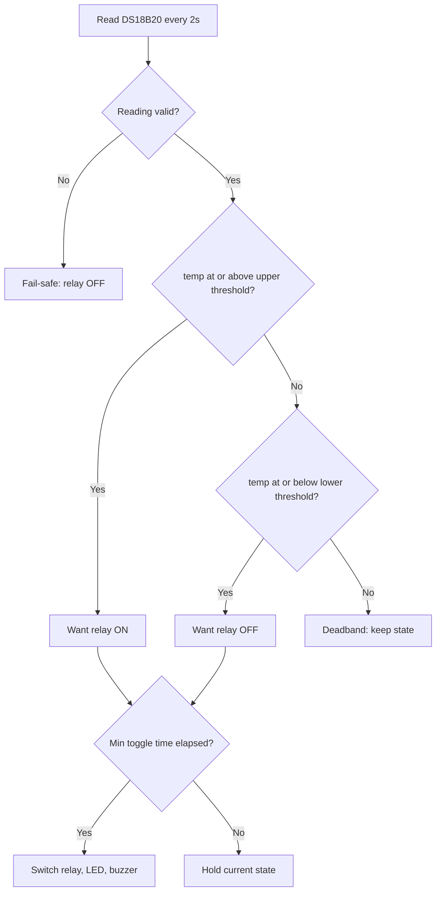

# Mini Cold Storage — ON/OFF Edition (Basic)

ESP32-based mini cold storage controller using classic **ON/OFF (bang-bang)
control with a hysteresis deadband**. Includes an OLED HMI, physical setpoint
buttons, NVS persistence, and **Blynk IoT** cloud monitoring.

This is the simplified, classroom-exercise version. For the full PID,
thesis-grade firmware, see [`../pid-thesis/`](../pid-thesis/).

---

## 1. What it does

The DS18B20 probe measures the cold-chamber temperature. Cooling switches ON or
OFF around the setpoint using a hysteresis band, so the relay does not chatter:

```
upper = setpoint + HYSTERESIS/2   -> relay ON   (too warm)
lower = setpoint - HYSTERESIS/2   -> relay OFF  (cold enough)
in between (deadband)             -> keep current state
```

With the default `HYSTERESIS_C = 1.5`, cooling turns on at setpoint + 0.75 °C
and off at setpoint − 0.75 °C. A minimum toggle interval further protects the
relay/compressor from short-cycling.

> ON/OFF control is simple and reliable but oscillates around the setpoint.
> For tighter regulation, use the PID edition.

### Control flowchart

`H` = `HYSTERESIS_C` · upper threshold = `setpoint + H/2` · lower threshold = `setpoint - H/2`



---

## 2. Hardware

| Component    | Spec                                   | Pin                     |
|--------------|----------------------------------------|-------------------------|
| MCU          | ESP32 DevKit v1 (240 MHz, Wi-Fi)       | —                       |
| Cold temp    | DS18B20, 1-Wire, **4.7 kΩ pull-up**    | GPIO4                   |
| Ambient/RH   | DHT11, **10 kΩ pull-up**               | GPIO16                  |
| Display      | OLED SSD1306 I²C 128×64 (addr `0x3C`)  | SDA=GPIO21, SCL=GPIO22  |
| Relay        | 10 A / 220 V, active-HIGH              | GPIO25                  |
| Status LED   | —                                      | GPIO26                  |
| Buzzer       | —                                      | GPIO15                  |
| Button UP    | INPUT_PULLUP, active-LOW               | GPIO32                  |
| Button DOWN  | INPUT_PULLUP, active-LOW               | GPIO33                  |

> If your relay board is active-LOW, set `RELAY_ACTIVE_LOW = true` in `main.cpp`.

---

## 3. Setup guide (step by step)

Follow these steps in order. You only need to edit **one file**: `src/main.cpp`.

### Step 1 — Install the tools (once)

- Install [VS Code](https://code.visualstudio.com/), then open the Extensions
  panel and install **"PlatformIO IDE"**. That's the whole toolchain — it pulls
  the ESP32 compiler and all libraries automatically on the first build.
- (Arduino IDE alternative: copy `src/main.cpp` into a `.ino` sketch and install
  the libraries from `platformio.ini` via *Tools → Manage Libraries*.)

### Step 2 — Create your Blynk device

1. Sign up at [blynk.cloud](https://blynk.cloud) and create a new **Template**.
2. Add the datastreams from the [table in section 5](#5-blynk-virtual-pins)
   (V0–V5), then create a **Device** from that template.
3. Blynk gives you three values: **Template ID**, **Template Name**, and the
   device **Auth Token** — copy them; you paste them in Step 3.

### Step 3 — Fill in your credentials (the only required edit)

Open `src/main.cpp` and replace the placeholders at the very top.
**These are the only lines you must change to get it running:**

```cpp
// --- lines 18-20: paste the 3 values from your Blynk device ---
#define BLYNK_TEMPLATE_ID   "TMPLxxxxxxxx"      // from Blynk → Template
#define BLYNK_TEMPLATE_NAME "Cold Storage"      // from Blynk → Template
#define BLYNK_AUTH_TOKEN    "your_auth_token"   // from Blynk → Device

// --- lines 34-35: your home Wi-Fi (2.4 GHz — ESP32 does not do 5 GHz) ---
char ssid[] = "YOUR_WIFI_NAME";
char pass[] = "YOUR_WIFI_PASSWORD";
```

> 💡 Leave everything else untouched the first time. The defaults already work
> for the wiring in [section 2](#2-hardware).

### Step 4 — Wire the hardware

Connect the parts per the pin table in [section 2](#2-hardware). The two pull-up
resistors (4.7 kΩ on DS18B20, 10 kΩ on DHT11) are **not optional** — without them
the sensors read garbage or `--`.

### Step 5 — Build & flash

Plug the ESP32 into USB, then from **this folder** run:

```bash
pio run                 # 1. compile (downloads libraries on first run)
pio run -t upload       # 2. flash the board over USB
pio device monitor      # 3. open the serial log @ 115200 baud
```

In VS Code/PlatformIO you can click the **✓ (Build)**, **→ (Upload)**, and
**🔌 (Monitor)** icons in the bottom toolbar instead of typing commands.

On boot the serial log prints `WiFi OK`, the device's IP, and the restored
setpoint — that confirms it is running.

---

## 4. How to change the behaviour

Everything below is **optional**. All tunables are named `constexpr` constants
near the top of `src/main.cpp` — change the number, re-flash (Step 5), done.

| Want to…                          | Edit this constant     | Example                        |
|-----------------------------------|------------------------|--------------------------------|
| Change the default target temp    | `DEFAULT_SETPOINT_C`   | `5.0f` for a 5 °C fridge        |
| Tighter temperature control       | `HYSTERESIS_C`         | `0.8f` (cycles relay more often) |
| Fewer relay cycles (gentler)      | `HYSTERESIS_C`         | `2.5f` (wider deadband)         |
| Use an active-LOW relay board     | `RELAY_ACTIVE_LOW`     | `true` if the relay is inverted  |
| Protect the compressor more       | `MIN_RELAY_TOGGLE_MS`  | raise to `30000` (30 s)         |

### Reference — all tuning constants

| Constant              | Default | Meaning                                |
|-----------------------|---------|----------------------------------------|
| `DEFAULT_SETPOINT_C`  | `8.0`   | Target temperature (°C)                |
| `HYSTERESIS_C`        | `1.5`   | Deadband width (°C) — wider = fewer cycles |
| `MIN_RELAY_TOGGLE_MS` | `10000` | Anti-short-cycle guard (ms)            |
| `SENSOR_READ_MS`      | `2000`  | Sensor poll interval (ms)              |

---

## 5. Blynk virtual pins

| Pin | Direction | Data                    | Suggested widget |
|-----|-----------|-------------------------|------------------|
| V0  | R/W       | Setpoint (°C)           | Slider −5…30     |
| V1  | R         | DS18B20 cold temp       | Gauge / Chart    |
| V2  | R         | DHT11 ambient temp      | Gauge            |
| V3  | R         | DHT11 humidity (%)      | Gauge            |
| V4  | R         | Relay/fan state (0/1)   | LED              |
| V5  | R         | Status text             | Labeled value    |

Setpoint can be changed via physical buttons or the Blynk slider (V0), stays in
sync across both, and survives reboot via NVS.

---

## 6. Safety

- **Fail-safe cooling off** when the DS18B20 read is invalid.
- **Anti-short-cycle**: relay never toggles faster than `MIN_RELAY_TOGGLE_MS`.
- **Non-blocking WiFi/Blynk reconnect** — control keeps running offline.

---

## 7. Project layout

```
basic-onoff/
├── platformio.ini
├── README.md
└── src/
    └── main.cpp
```

---

Author: **Tran Thinh Vuong** · Faculty of Automation, UTC · 2026
