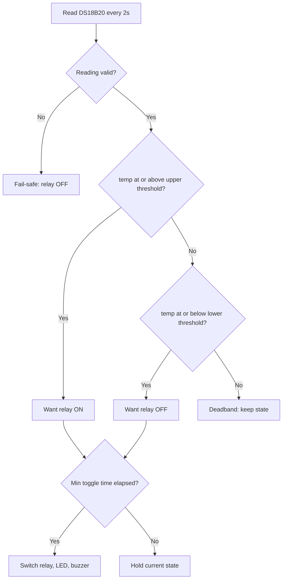

# Mini Cold Storage — ON/OFF Edition (Basic)

ESP32-based mini cold storage controller using classic **ON/OFF (bang-bang)
control with a hysteresis deadband**. Includes an OLED HMI, physical setpoint
buttons, NVS persistence, and **Blynk IoT** cloud monitoring.

This is the simplified, classroom-exercise version. For the full PID,
thesis-grade firmware, see [`../pid-thesis/`](../pid-thesis/).

---

## 1. What it does

The DS18B20 probe measures the cold-chamber temperature. Cooling switches ON or
OFF around the setpoint using a hysteresis band, so the relay does not chatter:

```
upper = setpoint + HYSTERESIS/2   -> relay ON   (too warm)
lower = setpoint - HYSTERESIS/2   -> relay OFF  (cold enough)
in between (deadband)             -> keep current state
```

With the default `HYSTERESIS_C = 1.5`, cooling turns on at setpoint + 0.75 °C
and off at setpoint − 0.75 °C. A minimum toggle interval further protects the
relay/compressor from short-cycling.

> ON/OFF control is simple and reliable but oscillates around the setpoint.
> For tighter regulation, use the PID edition.

### Control flowchart

`H` = `HYSTERESIS_C` · upper threshold = `setpoint + H/2` · lower threshold = `setpoint - H/2`



---

## 2. Hardware

| Component    | Spec                                   | Pin                     |
|--------------|----------------------------------------|-------------------------|
| MCU          | ESP32 DevKit v1 (240 MHz, Wi-Fi)       | —                       |
| Cold temp    | DS18B20, 1-Wire, **4.7 kΩ pull-up**    | GPIO4                   |
| Ambient/RH   | DHT11, **10 kΩ pull-up**               | GPIO16                  |
| Display      | OLED SSD1306 I²C 128×64 (addr `0x3C`)  | SDA=GPIO21, SCL=GPIO22  |
| Relay        | 10 A / 220 V, active-HIGH              | GPIO25                  |
| Status LED   | —                                      | GPIO26                  |
| Buzzer       | —                                      | GPIO15                  |
| Button UP    | INPUT_PULLUP, active-LOW               | GPIO32                  |
| Button DOWN  | INPUT_PULLUP, active-LOW               | GPIO33                  |

> If your relay board is active-LOW, set `RELAY_ACTIVE_LOW = true` in `main.cpp`.

---

## 3. Build & flash (PlatformIO)

```bash
# from this folder
pio run                 # compile
pio run -t upload       # flash over USB
pio device monitor      # serial @ 115200
```

Arduino IDE users: copy `src/main.cpp` into a `.ino` sketch and install the
libraries listed in `platformio.ini` via Library Manager.

---

## 4. Configuration

Before flashing, edit the top of `src/main.cpp`:

```cpp
#define BLYNK_TEMPLATE_ID   "..."   // from Blynk console
#define BLYNK_TEMPLATE_NAME "..."
#define BLYNK_AUTH_TOKEN    "..."

char ssid[] = "YOUR_WIFI_NAME";
char pass[] = "YOUR_WIFI_PASSWORD";
```

### Key tuning constants

| Constant              | Default | Meaning                                |
|-----------------------|---------|----------------------------------------|
| `DEFAULT_SETPOINT_C`  | `8.0`   | Target temperature (°C)                |
| `HYSTERESIS_C`        | `1.5`   | Deadband width (°C) — wider = fewer cycles |
| `MIN_RELAY_TOGGLE_MS` | `10000` | Anti-short-cycle guard (ms)            |
| `SENSOR_READ_MS`      | `2000`  | Sensor poll interval (ms)              |

---

## 5. Blynk virtual pins

| Pin | Direction | Data                    | Suggested widget |
|-----|-----------|-------------------------|------------------|
| V0  | R/W       | Setpoint (°C)           | Slider −5…30     |
| V1  | R         | DS18B20 cold temp       | Gauge / Chart    |
| V2  | R         | DHT11 ambient temp      | Gauge            |
| V3  | R         | DHT11 humidity (%)      | Gauge            |
| V4  | R         | Relay/fan state (0/1)   | LED              |
| V5  | R         | Status text             | Labeled value    |

Setpoint can be changed via physical buttons or the Blynk slider (V0), stays in
sync across both, and survives reboot via NVS.

---

## 6. Safety

- **Fail-safe cooling off** when the DS18B20 read is invalid.
- **Anti-short-cycle**: relay never toggles faster than `MIN_RELAY_TOGGLE_MS`.
- **Non-blocking WiFi/Blynk reconnect** — control keeps running offline.

---

## 7. Project layout

```
basic-onoff/
├── platformio.ini
├── README.md
└── src/
    └── main.cpp
```

---

Author: **Tran Thinh Vuong** · Faculty of Automation, UTC · 2026
