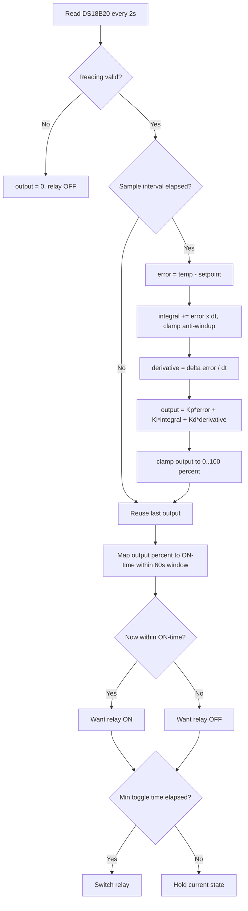

# Mini Cold Storage — PID Edition (Graduation Thesis)

ESP32-based automated mini cold storage controller using a **PID control loop**
with time-proportioning relay output, an OLED HMI, physical setpoint buttons,
NVS persistence, a hardware watchdog, and **Blynk IoT** cloud monitoring.

This is the full, thesis-grade firmware. For the simplified classroom version,
see [`../basic-onoff/`](../basic-onoff/).

---

## 1. What it does

The DS18B20 probe measures the cold-chamber temperature. A PID controller
computes an output of **0–100%**, which is mapped to an ON duty-cycle within a
fixed **60-second window**. This lets a slow ON/OFF compressor behave like a
modulating actuator while still protecting the relay from short-cycling.

```
error      = coldTemp - setpoint           (positive = too warm)
PID output = Kp*error + Ki*∫error + Kd*Δerror
relay ON   = (PID% / 100) * 60 s  within each 60 s window
```

Compared to ON/OFF control, PID gives tighter temperature regulation, less
overshoot, and a smoother duty-cycle — the key talking points for the thesis
defense.

### Control flowchart



---

## 2. Hardware

| Component    | Spec                                   | Pin                     |
|--------------|----------------------------------------|-------------------------|
| MCU          | ESP32 DevKit v1 (240 MHz, Wi-Fi)       | —                       |
| Cold temp    | DS18B20, 1-Wire, **4.7 kΩ pull-up**    | GPIO4                   |
| Ambient/RH   | DHT11, **10 kΩ pull-up**               | GPIO16                  |
| Display      | OLED SSD1306 I²C 128×64 (addr `0x3C`)  | SDA=GPIO21, SCL=GPIO22  |
| Relay        | 10 A / 220 V, active-HIGH              | GPIO25                  |
| Status LED   | —                                      | GPIO26                  |
| Buzzer       | —                                      | GPIO15                  |
| Button UP    | INPUT_PULLUP, active-LOW               | GPIO32                  |
| Button DOWN  | INPUT_PULLUP, active-LOW               | GPIO33                  |

> If your relay board is active-LOW, set `RELAY_ACTIVE_LOW = true` in `main.cpp`.

---

## 3. Build & flash (PlatformIO)

```bash
# from this folder
pio run                 # compile
pio run -t upload       # flash over USB
pio device monitor      # serial @ 115200
```

Arduino IDE users: copy `src/main.cpp` into a `.ino` sketch and install the
libraries listed in `platformio.ini` via Library Manager.

> Works on **ESP32 Arduino core 2.x and 3.x** — the watchdog init is
> version-guarded (`initWatchdog()`), so it compiles cleanly on both.

---

## 4. Configuration

Before flashing, edit the top of `src/main.cpp`:

```cpp
#define BLYNK_TEMPLATE_ID   "..."   // from Blynk console
#define BLYNK_TEMPLATE_NAME "..."
#define BLYNK_AUTH_TOKEN    "..."

char ssid[] = "YOUR_WIFI_NAME";
char pass[] = "YOUR_WIFI_PASSWORD";
```

### Key tuning constants

| Constant              | Default   | Meaning                                  |
|-----------------------|-----------|------------------------------------------|
| `DEFAULT_SETPOINT_C`  | `8.0`     | Target temperature (°C)                  |
| `PID_KP / KI / KD`    | `20/0.03/60` | PID gains                             |
| `PID_WINDOW_MS`       | `60000`   | Duty-cycle window (ms)                   |
| `PID_SAMPLE_MS`       | `2000`    | PID compute interval (ms)                |
| `MIN_RELAY_TOGGLE_MS` | `10000`   | Anti-short-cycle guard (ms)              |
| `WDT_TIMEOUT_S`       | `30`      | Watchdog reboot timeout (s)              |

---

## 5. Blynk virtual pins

| Pin | Direction | Data                    | Suggested widget |
|-----|-----------|-------------------------|------------------|
| V0  | R/W       | Setpoint (°C)           | Slider −5…30     |
| V1  | R         | DS18B20 cold temp       | Gauge / Chart    |
| V2  | R         | DHT11 ambient temp      | Gauge            |
| V3  | R         | DHT11 humidity (%)      | Gauge            |
| V4  | R         | Relay/fan state (0/1)   | LED              |
| V5  | R         | Status text             | Labeled value    |
| V6  | R         | PID output (%)          | Chart            |

Setpoint can be changed three ways and stays in sync: physical buttons, the
Blynk slider (V0), and it survives reboot via NVS.

---

## 6. Safety & robustness

- **Fail-safe cooling off** when the DS18B20 read is invalid.
- **Anti-short-cycle**: relay never toggles faster than `MIN_RELAY_TOGGLE_MS`.
- **PID anti-windup**: the integral term is clamped to the output range.
- **Hardware watchdog** reboots the MCU if `loop()` stalls for 30 s.
- **Non-blocking WiFi/Blynk reconnect** — the control loop keeps running even
  when the cloud is unreachable.

---

## 7. Project layout

```
pid-thesis/
├── platformio.ini
├── README.md
└── src/
    └── main.cpp
```

---

Author: **Tran Thinh Vuong** · Faculty of Automation, UTC · 2026
